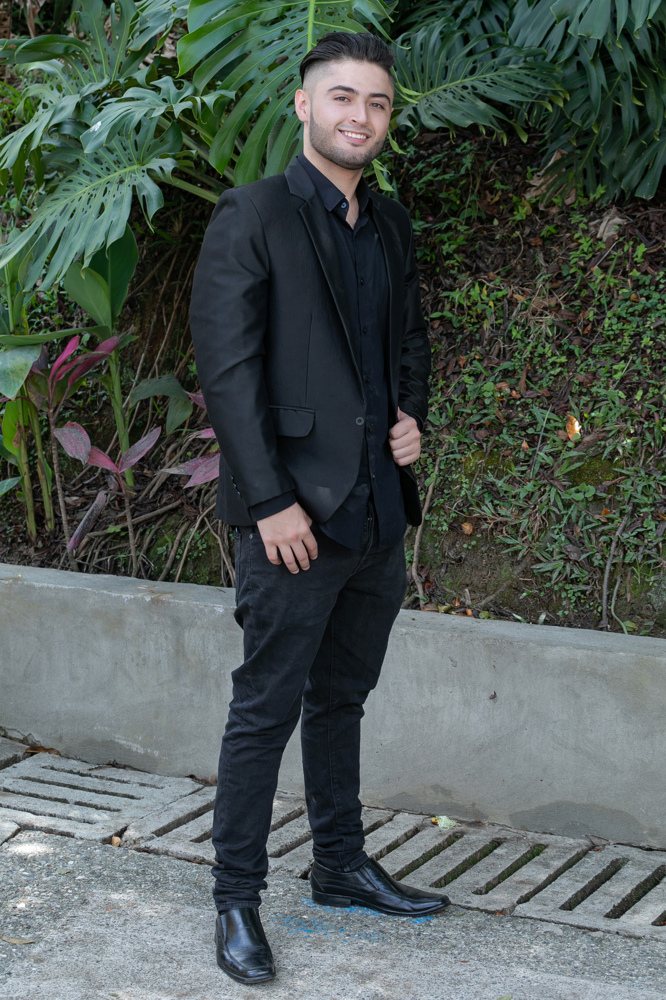
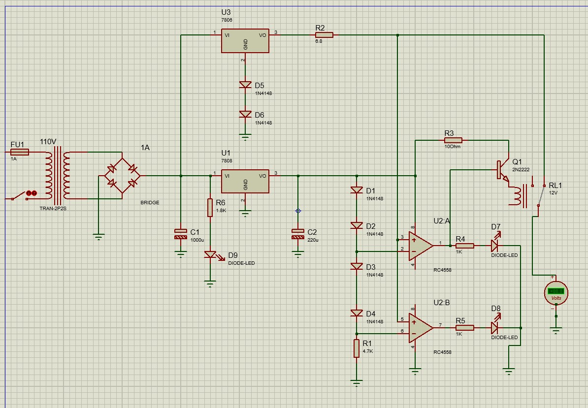
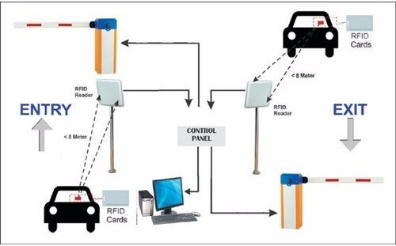

Juan Pablo Vargas betancur
clan: linus
Prueba De Desempeño Modulo 2
correo: pablovargas1999betancur@gmail.com
CC: 1214746463

The HTML is structured in a basic way, moving between sections or pages (about me, portfolio, and contact).
This way, the code is more readable and organized.

We have a repeating navigation menu to navigate between pages.

 <!-- <nav>
      <ul>
        <li><a href="./index.html">About Me</a></li>
        <li><a href="./portfolio.html">Portfolio</a></li>
        <li><a href="./contact.html">Contact</a></li>
      </ul>
    </nav> -->

We have a container with the presentation image, personal information and technical skills.

<!-- 

        <!-- Image to the side -->

        

        <!--Text on the other side -->
        

          
Hello, I am Juan Pablo Vargas.

          
I’m passionate about technology and software development.

          

            I’m an electronic technologist and currently enjoying learning
            various programming languages.
          

          <h3 class="details">Details about me</h3>
          

            I’m also passionate about video games and traveling, especially
            exploring different places in Colombia.
          

        

        <!-- Skills -->
        <section class="skills">
          <h3>Technical skills</h3>
          <ul class="skills">
            <li>PLC'S</li>
            <li>Arduino</li>
            <li>Maquinas Electricas</li>
            <li>Microcontroladores</li>
            <li>Electronica</li>
            <li>Python</li>
            <li>HTML and CSS...(learning)</li>
          </ul>
        </section>
     
 -->

In the second HTML file called portfolio we have 3 projects completed with links to PDF.

 <!-- <main>
      <!-- Projects -->

      <h2>PROJECTS</h2>
      <section class="projects">
        

          <h3>
            Project 1: Automatic charger with charge display for scale batteries
          </h3>

          
          

            This project was carried out for a company that specializes in the
            maintenance and repair of scales, where the use of batteries for
            portable scales is very intensive. that's why the idea of creating
            this charger came up — to have more automated control over those
            batteries.
          

          <!--Representative image of a project-->

          <a
            href="./ASSETS/DOCS/PRACTICA_JPVB_CAB_BYB_2021 (1).pdf"
            target="_blank"
            >Ver PDF</a
          >
        

        

          <h3>Project 2: Automated parking control</h3>
          
          

            Development of an automated control system for a parking lot at
            pascual bravo university
          

          <a href="./ASSETS/DOCS/Proyecto_VB_V6.pdf" target="_blank">Ver PDF</a>
        

        

          <h3>Project 3: led cube</h3>
          
          

            Lorem ipsum dolor sit amet consectetur adipisicing elit. Maxime
            delectus incidunt tempore voluptate voluptatum, eius harum eaque
            mollitia sequi minus doloremque autem velit quo ea dolorem, possimus
            ipsa. Esse, beatae?
          

          <a
            href="./ASSETS/DOCS/Cubo_LED_4_4_4.pdf"
            target="_blank"
            >Ver PDF</a
          >
        

      </section>
    </main> -->

In the third HTML file called contact we have a form and a link to our personal repository

<!-- <main class="contact">
      <h2>Contact</h2>
      <!--With this method we send the information from the form to the destination we decide.-->

      <!-- <form action="/send" method="post"> -->
      <form>
        <label for="Name">Name:</label> 
        <input
          type="text"
          name="Name"
          id="Name"
          placeholder="Name is"
          required
        /> 

        <label for="email">Email:</label> 
        <input
          type="email"
          name="email"
          id="email"
          placeholder="Email is?"
          required
        /> 

        <label for="message">Message:</label> 
        <textarea name="message" id="message" rows="4" required></textarea
        > 

        <input type="submit" value="Send" />
      </form>
      <!--Link to my social media(GitHub)-->
      <h2>My social media</h2>
      <ul>
        <li>
          <a
            href="https://github.com/Pabl0vargas?tab=repositories"
            target="_blank"
            >GitHub</a
          >
        </li>
      </ul>
    </main> -->

In this part of the CSS we define variables that we can reuse in different parts of the code or sections.

<!-- :root {
  --color-principal: #66625b;
  --color-secundario: #2e2a24;
  --color-acento: #eeebe7;
  --fuente-principal: "Segoe UI", Tahoma, Geneva, Verdana, sans-serif;
} -->

In the body we give base styles and generate a background image with infinite animation

<!-- body {
  font-family: var(--fuente-principal);
  background-color: #fcfcfc;
  color: #ddd2d2;
  line-height: 1.6;
  padding: 20px;
  background: linear-gradient(rgba(0, 0, 0, 0.388), rgba(0, 0, 0, 0.388)),
    url("./ASSETS/IMAGES/galaxy-illustration.jpg");
  background-attachment: fixed;
  background-repeat: repeat;
  background-size: auto;
  animation: moverFondo 30s linear infinite;
}
/* Animation for background */
@keyframes moverFondo {
  0% {
    background-position: 0 0;
  }
  100% {
    background-position: -450px 0;
  }
} -->

We styled the navigation menu with animations

<!-- nav {
  display: flex;
  background: rgba(255, 255, 255, 0.15);
  backdrop-filter: blur(10px);
  padding: 1rem;
  position: relative;
  width: 80%;
  justify-content: center;
  top: 1rem;
  border-radius: 30px;
  border: 1px solid rgba(255, 255, 255, 0.5);
  box-shadow: 0 6px 6px rgba(0, 0, 0, 0.5);
  margin-left: auto;
  margin-right: auto;
}
ul {
  list-style: none;
  display: flex;
  justify-content: center;
  gap: 3rem;
  margin: 0;
  padding: 0;
}
a {
  text-decoration: none;

  color: #ffffff;
  font-weight: 700;
  position: relative;
  padding: 5px 0;
  transition: color 0.3s ease;
  text-shadow: 2px 2px 4px rgba(0, 0, 0, 0.7);
}
/* Animation Nav */
a::after {
  content: "";
  position: absolute;
  width: 0;
  height: 3px;
  background: rgb(17, 0, 255);
  bottom: 0;
  left: 50%;
  transition: all 0.3s ease;
}
a:hover::after {
  width: 100%;
  left: 0;
}
a:hover {
  color: #4c39fc;
} -->

styles for the personal information container and animations

<!-- .about-container {
  display: flex;

  align-items: flex-start;
  gap: 30px;
  margin: 20px 0;
  flex-wrap: wrap; /* Para que sea responsive */
}

.about-container img.photo {
  width: 300px;
  height: 450px;
  border-radius: 10px;
  box-shadow: 0 4px 8px rgba(0, 0, 0, 0.3);
}

.about-text {
  flex: 1;
  min-width: 250px;
}

section.projects {
  display: grid;
  grid-template-columns: repeat(3, 1fr);
  gap: 20px;
}
.project-card {
  background-color: rgba(255, 255, 255, 0.07);
  padding: 20px;
  border-radius: 10px;
  text-align: center;
  border: 1px solid rgba(255, 255, 255, 0.15);
  box-shadow: 0 4px 10px rgba(0, 0, 0, 0.4);
  transition: transform 0.3s ease, box-shadow 0.3s ease;
  animation: fadeInUp 0.8s ease forwards;
  opacity: 0;
  min-height: 500px;
  display: flex;
  flex-direction: column;
  justify-content: space-between;
}

.project-card:hover {
  transform: translateY(-5px);
  box-shadow: 0 10px 16px rgba(0, 0, 0, 0.6);
}
ul.skills {
  display: grid;
  grid-template-columns: auto;
  align-items: center;
  text-align: left;
  gap: 8px;
}
.project-card img {
  transition: transform 0.3s ease, box-shadow 0.3s ease;
  cursor: pointer;
}
.project-card img:hover,
.project-card img:active {
  transform: scale(1.2);
  box-shadow: 0 8px 16px rgba(0, 0, 0, 0.6);

} -->

media queries for responsive design

<!-- @media (max-width: 768px) {
  nav ul {
    flex-direction: column;
    align-items: center;
    gap: 10px;
  }
  .about-container {
    flex-direction: column;
    align-items: center;
    text-align: center;
  }
  .about-text {
    text-align: left;
    padding: 0 10px;
  }

  section,
  .about-me,
  .contact {
    padding: 15px;
  }

  section.projects {
    display: grid;
    grid-template-columns: repeat(2, 1fr);
    gap: 20px;
  }
}
@media (max-width: 480px) {
  section.projects {
    display: grid;
    grid-template-columns: repeat(1, 1fr);
    gap: 20px;
  }

} -->
